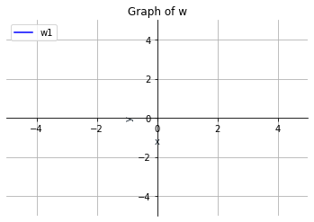
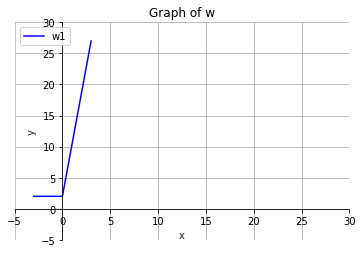
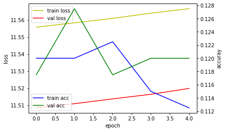

```python
# 21 relu 함수
# 모델, 층, 학습모듈

from tensorflow.keras.layers import Dense, Activation, Dropout
from tensorflow.keras.models import Sequential

model = Sequential()
model.add(Dense(512, activation = 'relu', input_shape = (784,)))
model


```


    <tensorflow.python.keras.engine.sequential.Sequential at 0x24166da7cd0>


```python
핵심모듈 : 모듈과 레이어를 생성하기 위한 기능
    - 활성화 모듈 : softmax, relu
    - loss 모듈 : error 모듈 손실기능
    - optimizer 모듈 : 최적화 기능을 수행 sgd등
    - 정규화 : l1 정규화 L2 정규화
```


```python
relu 함수
2D 텐서를 입력받고 입력텐서의 기능을 변환하는 3개의 텐서 연산을 한다
입력텐서 w 사이의 곱(dot), 곱을 결과인 2D텐서와 벡터 b 사이의 덧셈을 구한다
relu(x)는 max(x,0)


output = relu(dot(w.input)+b)
w : 2d tensor
b : vector

```


```python
import numpy as np

def naive_relu(x):
    assert len(x.shape) == 2
    x.copy()
    for i in range(x.shape[0]):
        for j in range(x.shape[1]):
            x[i,j] = max(x[i,j], 0)
    print(x)        
    return x


res = naive_relu(np.array([[1,2,3,4], [5,6,7,8]]))
res

x = [1,2,3,4]
y = [5,6,7,8]
z = x+y # 원소별 덧셈

z = np.maximum(z, 0.) # 원소별 relu 함수
z

```

    [[1 2 3 4]
     [5 6 7 8]]
    


    array([1., 2., 3., 4., 5., 6., 7., 8.])


```python
# exam01) 모든 입력 데이터에 0으로 설정해서 계층을 생성

from tensorflow.keras.layers import Dense, Activation, Dropout
from tensorflow.keras.models import Sequential
from keras import *

my_init = initializers.Zeros()
model = Sequential()
model.add(Dense(512, activation = 'relu', input_shape = (784,), kernel_initializer = my_init))
model


```


    <tensorflow.python.keras.engine.sequential.Sequential at 0x2416ff12a60>


```python
# exam01) 모든 입력 데이터에 0으로 설정해서 계층을 생성

from tensorflow.keras.layers import Dense, Activation, Dropout
from tensorflow.keras.models import Sequential
from keras import *

my_init = initializers.Ones()
model = Sequential()
model.add(Dense(512, activation = 'relu', input_shape = (784,), kernel_initializer = my_init))
model


```


    <tensorflow.python.keras.engine.sequential.Sequential at 0x24170005550>


```python

```


```python
import  tensorflow  as  tf
from matplotlib import pyplot as plt

tf.executing_eagerly()  # 계산 그래프를 즉시 실행 executing_eagerly 사용
x  =  tf . constant (3.0 )  
with  tf . GradientTape ()  as  g :  # with 내부 계산을 기록
   g . watch ( x )  # x를 기록
   y  =  2  *  x  # 미분 방정식
g.gradient( y ,  x ).numpy()  # x = 3 일 때의 y 기울기를 구한다. 
fig = plt.figure()  # 그림그리는 바탕을 fig로 만들겠다.
ax = fig.add_subplot(1, 1, 1)
ax.spines['left'].set_position('zero')
ax.spines['bottom'].set_position('zero')
ax.spines['right'].set_color('none')
ax.spines['top'].set_color('none')
ax.xaxis.set_ticks_position('bottom')
ax.yaxis.set_ticks_position('left')
plt.plot(x, y, '-b', label='w1')
plt.xlim(-5, 5)  # x 축의 눈금숫자의 시작과 마지막
plt.ylim(-5, 5)  # y 축의 눈금숫자의 시작과 마지막
plt.title('Graph of w')
plt.xlabel('x', color='#1C2833')  # x의 라벨 색깔
plt.ylabel('y', color='#1C2833')  # y의 라벨 색깔
plt.legend(loc='upper left')  # 레전드가 왼쪽에 나오게
plt.grid()  # 격자모양출력
plt.show()
```


    

    


```python
import tensorflow as tf
a = tf.Variable(3.0)
b = tf.Variable(4.0)

with tf.GradientTape() as g:
    f = a**2 + 5 *b
    
g.gradient(f, [a,b]) # 기울기
    


```


    [<tf.Tensor: shape=(), dtype=float32, numpy=6.0>,
     <tf.Tensor: shape=(), dtype=float32, numpy=5.0>]


```python
import tensorflow as tf
a = tf.Variable(3.0)
b = tf.Variable(4.0)

with tf.GradientTape() as g:
    f = a**2 + 5 *b
    
g.gradient(f, [b,[a]])
    


```


    [<tf.Tensor: shape=(), dtype=float32, numpy=5.0>,
     [<tf.Tensor: shape=(), dtype=float32, numpy=6.0>]]


```python

```


```python
import  tensorflow  as  tf
from matplotlib import pyplot as plt


def Test(x,y):
    fig = plt.figure()  # 그림그리는 바탕을 fig로 만들겠다.
    ax = fig.add_subplot(1, 1, 1)
    ax.spines['left'].set_position('zero')
    ax.spines['bottom'].set_position('zero')
    ax.spines['right'].set_color('none')
    ax.spines['top'].set_color('none')
    ax.xaxis.set_ticks_position('bottom')
    ax.yaxis.set_ticks_position('left')
    plt.plot(x, y, '-b', label='w1')
    plt.xlim(-5, 30)  # x 축의 눈금숫자의 시작과 마지막
    plt.ylim(-5, 30)  # y 축의 눈금숫자의 시작과 마지막
    plt.title('Graph of w')
    plt.xlabel('x', color='#1C2833')  # x의 라벨 색깔
    plt.ylabel('y', color='#1C2833')  # y의 라벨 색깔
    plt.legend(loc='upper left')  # 레전드가 왼쪽에 나오게
    plt.grid()  # 격자모양출력
    plt.show()
    
x = [-3.0, 0.0, 3.0]
y = [2.0, 2.0, 27.0]
Test(x,y)


```


    

    


```python
#exam) 모델 생성

from tensorflow.keras.layers import Dense, Activation, Dropout
from tensorflow.keras.models import Sequential

model = Sequential()

input_layer = Dense(32, input_shape = (8,))
model.add(input_layer)

hidden_layer = Dense(64, activation = "relu")
model.add(hidden_layer)

output_layer = Dense(8)
model.add(output_layer)

layers = model.layers
print(layers)

inputs = model.inputs # 모델의 모든 입력텐서 반환
print(inputs)

outputs = model.outputs 
print(outputs)


```

    [<tensorflow.python.keras.layers.core.Dense object at 0x0000024171657D90>, <tensorflow.python.keras.layers.core.Dense object at 0x0000024171671DF0>, <tensorflow.python.keras.layers.core.Dense object at 0x0000024171690E20>]
    [<KerasTensor: shape=(None, 8) dtype=float32 (created by layer 'dense_15_input')>]
    [<KerasTensor: shape=(None, 8) dtype=float32 (created by layer 'dense_17')>]
    


```python
model = Sequential()
input_layer = Dense(32, input_shape = (8,))
model.add(input_layer)
model.get_weights() # 모든 가중치를 numpy 배열로 반환


```


    [array([[ 0.33380842, -0.28015327,  0.01030394, -0.06557998,  0.04601479,
             -0.14516374,  0.37616098, -0.01890579, -0.1552216 , -0.06250694,
             -0.12713805,  0.03061235,  0.32669258,  0.17075193,  0.27576435,
             -0.37663132,  0.2680754 ,  0.21027029,  0.26984984,  0.21832752,
             -0.25672758,  0.0596979 , -0.07369125,  0.34940302,  0.22090751,
             -0.3785795 ,  0.31084877, -0.06613716, -0.10965353, -0.25548303,
              0.15014756,  0.18289524],
            [ 0.08453101,  0.0823243 ,  0.14826304, -0.12713203,  0.04779324,
             -0.322235  ,  0.24579698,  0.03407341, -0.02407023, -0.35698915,
             -0.2621202 ,  0.22902042, -0.20202489,  0.14997095,  0.27512258,
              0.34741956,  0.24819905,  0.22140557, -0.2041448 ,  0.03425938,
             -0.13704824, -0.37162545,  0.3281263 , -0.21629506, -0.29059666,
              0.38334578, -0.23785071, -0.23566939,  0.08027843, -0.23418614,
             -0.11676911, -0.330582  ],
            [-0.03069168,  0.2554776 , -0.14731358,  0.03924146,  0.37569147,
             -0.2609741 , -0.366402  ,  0.2832991 , -0.01173002,  0.11271465,
              0.34521025, -0.26731318,  0.3307194 ,  0.2582221 ,  0.20874858,
              0.29160333,  0.06246004,  0.10050088,  0.12700099, -0.33649853,
             -0.03839073, -0.1463262 , -0.28803924, -0.18550117,  0.0775561 ,
             -0.21747294, -0.28717098,  0.14828879, -0.01555952,  0.21521324,
             -0.18970445,  0.16138238],
            [ 0.11820966,  0.05170667, -0.32343918,  0.02269143,  0.14936906,
              0.09566969, -0.08364013,  0.0788554 , -0.1064564 , -0.05398598,
             -0.05445904, -0.18593433,  0.19534314, -0.01547807,  0.05727658,
              0.11750954,  0.01002887, -0.07700971,  0.22276658,  0.01984951,
              0.26366335, -0.32247195,  0.13270915,  0.38296598,  0.2005027 ,
             -0.18326157,  0.12043107, -0.2632134 , -0.38091153,  0.13716578,
              0.36608702,  0.21908951],
            [ 0.1532535 ,  0.0722585 , -0.3778756 ,  0.18036747, -0.13751465,
             -0.21517074, -0.27883348, -0.3138349 , -0.28309715, -0.22351728,
             -0.13209048,  0.14269459, -0.06961778,  0.04398942, -0.1464322 ,
              0.2598083 ,  0.13405156,  0.27504516, -0.12905556, -0.269175  ,
             -0.361389  , -0.00644481, -0.11645311, -0.17160256,  0.2982754 ,
             -0.34453657, -0.07366613, -0.03393149, -0.36120296, -0.12252027,
             -0.27108687,  0.3527525 ],
            [-0.29632592, -0.3306699 , -0.35356796,  0.1557532 ,  0.30379987,
             -0.04884821, -0.13170782, -0.3664417 , -0.17330483,  0.08258572,
             -0.30522928, -0.25074208,  0.32590485,  0.23868555, -0.21712057,
             -0.0219239 ,  0.29192615, -0.21966405, -0.04541737,  0.2776907 ,
             -0.14150675,  0.2809437 ,  0.11110216, -0.13039142,  0.13542205,
              0.02004561,  0.3054753 ,  0.26219386,  0.11596084,  0.06991631,
              0.2550416 , -0.2662246 ],
            [-0.3641711 ,  0.09727639,  0.07856774,  0.38196558, -0.1973153 ,
             -0.22159542, -0.16949539,  0.22195953, -0.01304901,  0.35393482,
             -0.27317163,  0.3290726 , -0.08126858, -0.32947457,  0.3239333 ,
              0.08288831,  0.20508778,  0.32258588, -0.32804164,  0.19944584,
              0.2623211 ,  0.09619752,  0.19538194, -0.372812  , -0.25122058,
              0.01185495, -0.24409506,  0.27131808,  0.00163531, -0.11663586,
             -0.02809474, -0.00574285],
            [-0.09278882,  0.26131362, -0.184011  , -0.03390914,  0.26835763,
              0.05521059,  0.1346491 , -0.13344747, -0.32792383, -0.18461268,
             -0.03833202, -0.16815692, -0.29797244,  0.24564081,  0.3764354 ,
             -0.284343  ,  0.01040006,  0.04280049,  0.06172705, -0.02524331,
             -0.17071177,  0.15895617,  0.14062041,  0.14068961, -0.05071321,
              0.19341743,  0.05145395, -0.07870534, -0.21773851, -0.1627117 ,
             -0.28022495,  0.35495877]], dtype=float32),
     array([0., 0., 0., 0., 0., 0., 0., 0., 0., 0., 0., 0., 0., 0., 0., 0., 0.,
            0., 0., 0., 0., 0., 0., 0., 0., 0., 0., 0., 0., 0., 0., 0.],
           dtype=float32)]


```python
model = Sequential()
input_layer = Dense(4, input_shape = (8,))
model.add(input_layer)
model.get_weights() # 모든 가중치를 numpy 배열로 반환


```


    [array([[ 0.29741782,  0.04842418, -0.38065213,  0.18126953],
            [-0.07992274, -0.61873984,  0.10519618,  0.10163206],
            [-0.27846   ,  0.24781388, -0.4749186 ,  0.28614795],
            [ 0.08341992, -0.62021077,  0.13992196, -0.22182241],
            [ 0.6981749 , -0.3993385 ,  0.65463597,  0.4346469 ],
            [ 0.32637745, -0.5060762 , -0.6461267 , -0.0629667 ],
            [ 0.15071946, -0.1832267 , -0.32593474, -0.33896384],
            [ 0.50387114,  0.15698165,  0.25945985,  0.31952387]],
           dtype=float32),
     array([0., 0., 0., 0.], dtype=float32)]


```python
# 모델의 직렬화
config = model.get_config()
config
```


    {'name': 'sequential_10',
     'layers': [{'class_name': 'InputLayer',
       'config': {'batch_input_shape': (None, 8),
        'dtype': 'float32',
        'sparse': False,
        'ragged': False,
        'name': 'dense_18_input'}},
      {'class_name': 'Dense',
       'config': {'name': 'dense_18',
        'trainable': True,
        'batch_input_shape': (None, 8),
        'dtype': 'float32',
        'units': 32,
        'activation': 'linear',
        'use_bias': True,
        'kernel_initializer': {'class_name': 'GlorotUniform',
         'config': {'seed': None}},
        'bias_initializer': {'class_name': 'Zeros', 'config': {}},
        'kernel_regularizer': None,
        'bias_regularizer': None,
        'activity_regularizer': None,
        'kernel_constraint': None,
        'bias_constraint': None}}]}


```python
# 로드

json_string = model.to_json()
json_string
```


    '{"class_name": "Sequential", "config": {"name": "sequential_10", "layers": [{"class_name": "InputLayer", "config": {"batch_input_shape": [null, 8], "dtype": "float32", "sparse": false, "ragged": false, "name": "dense_18_input"}}, {"class_name": "Dense", "config": {"name": "dense_18", "trainable": true, "batch_input_shape": [null, 8], "dtype": "float32", "units": 32, "activation": "linear", "use_bias": true, "kernel_initializer": {"class_name": "GlorotUniform", "config": {"seed": null}}, "bias_initializer": {"class_name": "Zeros", "config": {}}, "kernel_regularizer": null, "bias_regularizer": null, "activity_regularizer": null, "kernel_constraint": null, "bias_constraint": null}}]}, "keras_version": "2.4.0", "backend": "tensorflow"}'


```python
from keras.models import model_from_json

new_model = model_from_json(json_string)
new_model
```


    <tensorflow.python.keras.engine.sequential.Sequential at 0x2417166e3a0>


```python
# 모델값을 문자열로
res = model.to_yaml()
res
```


    'backend: tensorflow\nclass_name: Sequential\nconfig:\n  layers:\n  - class_name: InputLayer\n    config:\n      batch_input_shape: !!python/tuple\n      - null\n      - 8\n      dtype: float32\n      name: dense_14_input\n      ragged: false\n      sparse: false\n  - class_name: Dense\n    config:\n      activation: linear\n      activity_regularizer: null\n      batch_input_shape: !!python/tuple\n      - null\n      - 8\n      bias_constraint: null\n      bias_initializer:\n        class_name: Zeros\n        config: {}\n      bias_regularizer: null\n      dtype: float32\n      kernel_constraint: null\n      kernel_initializer:\n        class_name: GlorotUniform\n        config:\n          seed: null\n      kernel_regularizer: null\n      name: dense_14\n      trainable: true\n      units: 4\n      use_bias: true\n  name: sequential_8\nkeras_version: 2.4.0\n'


```python
# 모델 요약
model.summary()
```

    Model: "sequential_8"
    _________________________________________________________________
    Layer (type)                 Output Shape              Param #   
    =================================================================
    dense_14 (Dense)             (None, 4)                 36        
    =================================================================
    Total params: 36
    Trainable params: 36
    Non-trainable params: 0
    _________________________________________________________________
    


```python
#모델 훈련 및 예측 : 컴파일(모델의 학습과정) -> fit(훈련데이터 모델 훈련) 
#                    -> 평가(테스트 데이터 모델 평가) -> 예측(새로운 입력에 대한 결과를 예측)

```


```python
# 모델 생성연습
from keras.layers import Input
from tensorflow.keras.layers import Dense, Activation, Dropout
from tensorflow.keras.models import *


data = Input(shape=(2,3))
layer = Dense(2)(data)
print(layer)

model = Model(inputs = data, outputs = layer)
model
model.summary()
```

    KerasTensor(type_spec=TensorSpec(shape=(None, 2, 2), dtype=tf.float32, name=None), name='dense_21/BiasAdd:0', description="created by layer 'dense_21'")
    Model: "model_2"
    _________________________________________________________________
    Layer (type)                 Output Shape              Param #   
    =================================================================
    input_4 (InputLayer)         [(None, 2, 3)]            0         
    _________________________________________________________________
    dense_21 (Dense)             (None, 2, 2)              8         
    =================================================================
    Total params: 8
    Trainable params: 8
    Non-trainable params: 0
    _________________________________________________________________
    


```python
from tensorboardX import SummaryWriter
summary = SummaryWriter()

```


```python

# 간단한 모델 컴파일
from tensorflow.keras.layers import Dense, Activation, Dropout, LSTM
from tensorflow.keras.models import *
from keras.layers import Input
import numpy as np
from tensorboardX import SummaryWriter
from datetime import datetime
from packaging import version
import keras

summary = SummaryWriter()
logdir="logs\\fit\\" + datetime.now().strftime("%Y%m%d-%H%M%S")
tensorboard_callback = keras.callbacks.TensorBoard(log_dir=logdir)

# 임의의 데이터
x_train = np.random.random((100,4,8))
y_train = np.random.random((100,4,10))

# 임의의 유효성 검사 데이터
x_val = np.random.random((100,4,8))
y_val = np.random.random((100,4,10))

# 순차모델링
model = tf.keras.Sequential()

# 모델 추가, 레이어 추가
model.add(LSTM(16, return_sequences = True)) # 순환신경망 모델
model.add(Dense(10, activation = 'softmax'))

# 모델 컴파일
model.compile(loss = 'categorical_crossentropy', optimizer = 'sgd', metrics = ['accuracy'])

# 데이터 훈련
hist = model.fit(x_train, y_train, batch_size =32, epochs = 3, validation_data = (x_val, y_val),
                callbacks = [tensorboard_callback])

print(type(hist))
print(hist.history['loss'])
print(hist.history['accuracy'])
print(hist.history['val_loss'])
print(hist.history['val_accuracy'])

# fit()  히스토리 가능
'''
loss : 훈련손실값
accuracy : 훈련정확도
val_loss : 검증손실값
val_accuracy : 검증정확도


'''


```

    Epoch 1/3
    4/4 [==============================] - 9s 1s/step - loss: 11.3922 - accuracy: 0.0652 - val_loss: 11.6129 - val_accuracy: 0.1175
    Epoch 2/3
    4/4 [==============================] - 0s 33ms/step - loss: 11.5063 - accuracy: 0.0739 - val_loss: 11.6141 - val_accuracy: 0.1150
    Epoch 3/3
    4/4 [==============================] - 0s 40ms/step - loss: 11.5183 - accuracy: 0.0759 - val_loss: 11.6152 - val_accuracy: 0.1150
    <class 'tensorflow.python.keras.callbacks.History'>
    [11.477855682373047, 11.477264404296875, 11.477697372436523]
    [0.07000000029802322, 0.06750000268220901, 0.07000000029802322]
    [11.612889289855957, 11.61413288116455, 11.615196228027344]
    [0.11749999970197678, 0.11500000208616257, 0.11500000208616257]
    


    '\nloss : 훈련손실값\naccuracy : 훈련정확도\nval_loss : 검증손실값\nval_accuracy : 검증정확도\n\n\n'


```python
# 간단한 모델 컴파일 해보자.  
import numpy as np 
from keras.layers import Input
from keras.models import * 
from keras.layers import Dense, Activation, Dropout, LSTM

#임의의 데이터  
x_train = np.random.random((100,4,8)) 
y_train = np.random.random((100,4,10))

# 임의의 유효성 검사 데이터  
x_val = np.random.random((100,4,8)) 
y_val = np.random.random((100,4,10))

# 순차 모델링
model =Sequential()

# 모델 추가, 레이어 추가  
model.add(LSTM(16, return_sequences = True)) 
model.add(Dense(10, activation = 'softmax'))

# 모델 컴파일  
model.compile(  loss = 'categorical_crossentropy', optimizer = 'sgd', metrics = ['accuracy'])

#데이터 훈련 
hist =model.fit(x_train, y_train, batch_size = 32, epochs = 5, validation_data = (x_val, y_val))

import matplotlib.pyplot as plt

fig, loss_ax = plt.subplots()
acc_ax = loss_ax.twinx()
loss_ax.plot(hist.history['loss'], 'y', label='train loss')
loss_ax.plot(hist.history['val_loss'], 'r', label='val loss')

acc_ax.plot(hist.history['accuracy'], 'b', label='train acc')
acc_ax.plot(hist.history['val_accuracy'], 'g', label='val acc')

loss_ax.set_xlabel('epoch')
loss_ax.set_ylabel('loss')
acc_ax.set_ylabel('accuray')

loss_ax.legend(loc='upper left')
acc_ax.legend(loc='lower left')

plt.show()
```

    Epoch 1/5
    4/4 [==============================] - 7s 456ms/step - loss: 11.4704 - accuracy: 0.1147 - val_loss: 11.5085 - val_accuracy: 0.1175
    Epoch 2/5
    4/4 [==============================] - 0s 38ms/step - loss: 11.6021 - accuracy: 0.1300 - val_loss: 11.5110 - val_accuracy: 0.1275
    Epoch 3/5
    4/4 [==============================] - 0s 39ms/step - loss: 11.5062 - accuracy: 0.1269 - val_loss: 11.5138 - val_accuracy: 0.1175
    Epoch 4/5
    4/4 [==============================] - 0s 34ms/step - loss: 11.4793 - accuracy: 0.1192 - val_loss: 11.5165 - val_accuracy: 0.1200
    Epoch 5/5
    4/4 [==============================] - 0s 41ms/step - loss: 11.5090 - accuracy: 0.1023 - val_loss: 11.5199 - val_accuracy: 0.1200
    


    

    


```python
(One - Hot encoding) : 사람이 인식할 수 잇는 데이터를 숫자로 변환정렬시켜서 컴퓨터에 주입
    
Data -> 숫자
단어 -> 숫자
딥러닝 : 문자열 -> 분철 -> 숫자 인덱싱 -> 원핫 인코딩

    

```


```python
import tensorflow as tf
from tensorflow.keras.preprocessing.text import Tokenizer

str = "저는 하루 이상 휴일을 좋아합니다. 그 중 저는 목요일을 가장 좋아한다"
tokenizer = Tokenizer()
tokenizer.fit_on_texts([str])
print(tokenizer.word_index)

```

    {'저는': 1, '하루': 2, '이상': 3, '휴일을': 4, '좋아합니다': 5, '그': 6, '중': 7, '목요일을': 8, '가장': 9, '좋아한다': 10}
    


```python
encode = tokenizer.texts_to_sequences([str])[0]
print(encode)
```

    [1, 2, 3, 4, 5, 6, 7, 1, 8, 9, 10]
    


```python
onehot = tf.keras.utils.to_categorical(encode)
print(onehot)
```

    [[0. 1. 0. 0. 0. 0. 0. 0. 0. 0. 0.]
     [0. 0. 1. 0. 0. 0. 0. 0. 0. 0. 0.]
     [0. 0. 0. 1. 0. 0. 0. 0. 0. 0. 0.]
     [0. 0. 0. 0. 1. 0. 0. 0. 0. 0. 0.]
     [0. 0. 0. 0. 0. 1. 0. 0. 0. 0. 0.]
     [0. 0. 0. 0. 0. 0. 1. 0. 0. 0. 0.]
     [0. 0. 0. 0. 0. 0. 0. 1. 0. 0. 0.]
     [0. 1. 0. 0. 0. 0. 0. 0. 0. 0. 0.]
     [0. 0. 0. 0. 0. 0. 0. 0. 1. 0. 0.]
     [0. 0. 0. 0. 0. 0. 0. 0. 0. 1. 0.]
     [0. 0. 0. 0. 0. 0. 0. 0. 0. 0. 1.]]
    


```python
onehot = tf.keras.utils.to_categorical(encode, 20)
print(onehot)
```

    [[0. 1. 0. 0. 0. 0. 0. 0. 0. 0. 0. 0. 0. 0. 0. 0. 0. 0. 0. 0.]
     [0. 0. 1. 0. 0. 0. 0. 0. 0. 0. 0. 0. 0. 0. 0. 0. 0. 0. 0. 0.]
     [0. 0. 0. 1. 0. 0. 0. 0. 0. 0. 0. 0. 0. 0. 0. 0. 0. 0. 0. 0.]
     [0. 0. 0. 0. 1. 0. 0. 0. 0. 0. 0. 0. 0. 0. 0. 0. 0. 0. 0. 0.]
     [0. 0. 0. 0. 0. 1. 0. 0. 0. 0. 0. 0. 0. 0. 0. 0. 0. 0. 0. 0.]
     [0. 0. 0. 0. 0. 0. 1. 0. 0. 0. 0. 0. 0. 0. 0. 0. 0. 0. 0. 0.]
     [0. 0. 0. 0. 0. 0. 0. 1. 0. 0. 0. 0. 0. 0. 0. 0. 0. 0. 0. 0.]
     [0. 1. 0. 0. 0. 0. 0. 0. 0. 0. 0. 0. 0. 0. 0. 0. 0. 0. 0. 0.]
     [0. 0. 0. 0. 0. 0. 0. 0. 1. 0. 0. 0. 0. 0. 0. 0. 0. 0. 0. 0.]
     [0. 0. 0. 0. 0. 0. 0. 0. 0. 1. 0. 0. 0. 0. 0. 0. 0. 0. 0. 0.]
     [0. 0. 0. 0. 0. 0. 0. 0. 0. 0. 1. 0. 0. 0. 0. 0. 0. 0. 0. 0.]]
    


```python
# exam) 모델링 학습
import pandas as pd
import numpy as np
from keras.models import Sequential
from keras.layers import Dense
from keras.layers import Dropout
from keras.layers import Flatten
from keras.layers import Activation
from keras.layers.convolutional import Conv2D
from keras.layers.convolutional import MaxPooling2D
from keras.optimizers import Adam
from keras.utils import np_utils
from keras import backend as K
from sklearn.utils import shuffle
import tensorflow as tf


```


```python
# 1. 데이터 로드
test = pd.read_csv('C:\\Users\\Playdata\\Downloads\\titanic\\test.csv')
train = pd.read_csv('C:\\Users\\Playdata\\Downloads\\titanic\\train.csv')

train_x = train.drop("Survived", axis = 1)
train_y =  train["Survived"]
test_x = test

# 결측값 삭제하기
train_x = train_x.drop(['Name', 'Ticket', 'Cabin'], axis = 1)
test_x = test_x.drop(['Name', 'Ticket', 'Cabin'], axis = 1)

# train 결측값을 채우기
train_age_median = train_x["Age"].median()
train_x["Age"] = train_x["Age"].fillna(train_age_median)
train_x["Embarked"] = train_x["Embarked"].fillna("S")

# test 결측값을 채우기
test_age_median = test_x["Age"].median()
test_x["Age"] = test_x["Age"].fillna(test_age_median)

test_x["Fare"] = test_x["Fare"].fillna(test_x["Fare"].describe()[5])

# 더미 컬럼 생성
train_x_dummy = pd.get_dummies(train_x, columns= ["Sex","Embarked"])
test_x_dummy = pd.get_dummies(test_x, columns= ["Sex","Embarked"])

# one-hot
train_y_onehot = np_utils.to_categorical(train_y)
train_x_dummy_array = train_x_dummy.values.astype('float32')


```


```python
# 2. 모델 생성
from tensorflow.keras import layers

model = tf.keras.Sequential()
model.add(layers.Dense(64, activation = "relu"))
model.add(layers.Dense(64, activation = "relu"))
model.add(layers.Dense(2, activation = "softmax"))

# 3. 컴파일
model.compile(optimizer = 'rmsprop', loss = 'categorical_crossentropy', metrics = ['accuracy'])
model.compile(optimizer = 'sgd', loss = 'mse', metrics = [tf.keras.metrics.Recall()])

#4. fit()
model.fit(train_x_dummy_array, train_y_onehot, epochs = 10, batch_size = 32)

#5. 저장
model.save("res.h5")
```

    Epoch 1/10
    28/28 [==============================] - 1s 2ms/step - loss: 0.3516 - recall_5: 0.6425
    Epoch 2/10
    28/28 [==============================] - 0s 2ms/step - loss: 0.3823 - recall_5: 0.6113
    Epoch 3/10
    28/28 [==============================] - 0s 3ms/step - loss: 0.6178 - recall_5: 0.3821
    Epoch 4/10
    28/28 [==============================] - 0s 2ms/step - loss: 0.5981 - recall_5: 0.4016
    Epoch 5/10
    28/28 [==============================] - 0s 3ms/step - loss: 0.5973 - recall_5: 0.4023
    Epoch 6/10
    28/28 [==============================] - 0s 3ms/step - loss: 0.6152 - recall_5: 0.3844
    Epoch 7/10
    28/28 [==============================] - 0s 2ms/step - loss: 0.6171 - recall_5: 0.3823
    Epoch 8/10
    28/28 [==============================] - 0s 3ms/step - loss: 0.6216 - recall_5: 0.3775
    Epoch 9/10
    28/28 [==============================] - 0s 2ms/step - loss: 0.6199 - recall_5: 0.3780
    Epoch 10/10
    28/28 [==============================] - 0s 3ms/step - loss: 0.5348 - recall_5: 0.4572
    


```python
from tensorflow.keras.metrics import Precision, Recall
model.compile(loss = 'binary_crossentropy', optimizer = 'sgd', metrics = [Precision(),Recall()])

```


```python

```


```python

```


```python

```


```python

```


```python

```


```python

```
